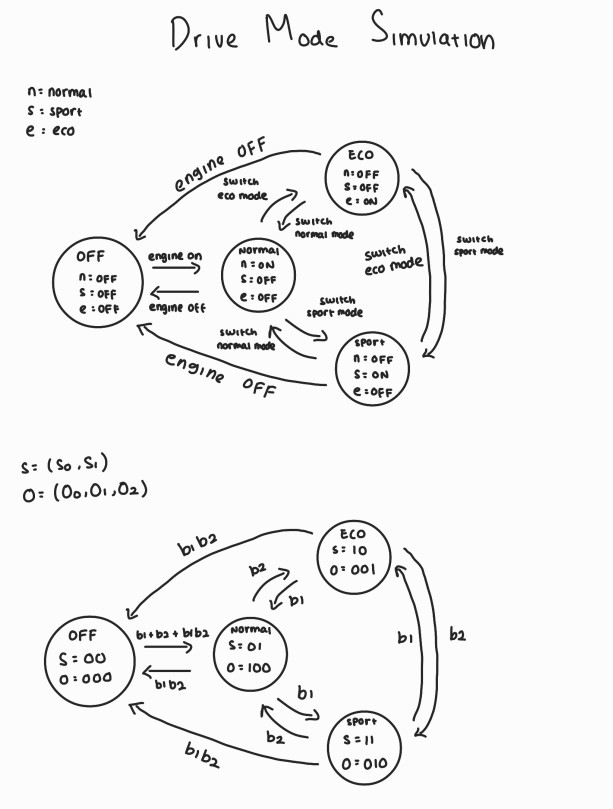
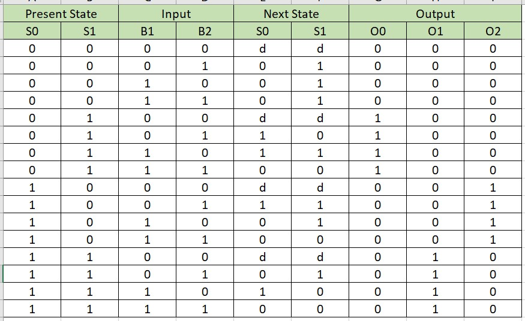
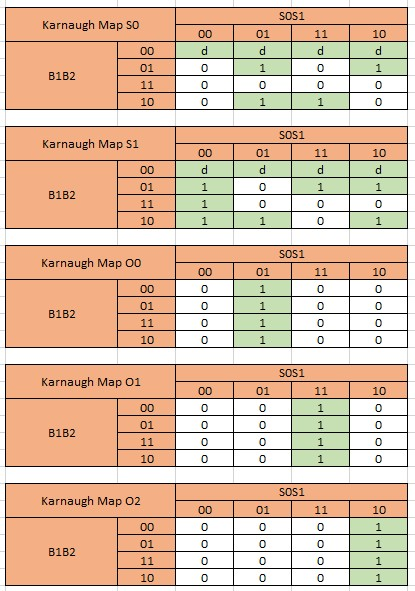
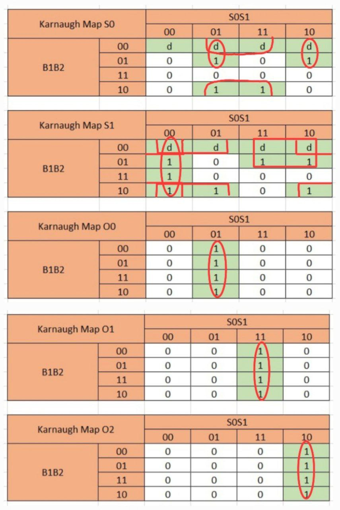

# FSM Drive Mode Simulation

# Table of contents
* [About](#about)
* [Visualization](#Visualization)
* [State Diagram](#State_Diagram)
* [Truth Table](#Truth_Table)
* [Karnaugh Map](#K-map)
* [Running the code](#Runthecode)
* [Output](#Output)

# About:
There are 3 types of drive mode in a car (Normal, Eco, Sport). The starting state of the engine is 'off'. When we press either button 1 (b1), button 2 (b2), or both buttons (b1 and b2), the engine will turn on and starts at normal mode. 

Consequently pressing button 2 (b2) will switch the state over in this order: normal -> eco -> sport -> normal. Pressing button 1 (b1) does the opposite (normal -> sport -> eco -> normal). 

So there's 4 states :
* engine off (s = 00)
* normal mode (s = 01)
* eco mode (s = 10)
* sport mode (s = 11)

And there's 2 input:
* button 1 (b1)
* button 2 (b2)


# Visualization:


## State Diagram:


## Truth Table:


## Karnaugh Map:


## Derive Combinatorial Boolean Equation from K-map:

* S0 = B2' s1 + B1' s0 s1' + B1' s0' s1
* S1 = B2' s1' + s0' s1' + B2' s0' + B1' s0
* O0 = s0' s1
* O1 = s0 s1
* O2 = s0 s1'


# Running the code:
* in Visual Studio Code (VSC)
Type the command "make run" in terminal

* output
```
B1: 0; B2: 0
S0 is now: 0
S1 is now: 0

                    Off
                    /\
                ==========
              //          \\       
             //            \\      
            ||              ||     
 sport mode ||              || normal mode   
            ||              ||
             \\            //
              \\          //
                ==========
                 eco mode

 Engine is off!

 Button 1/2/3(both):

```
* if we pressed button 1 / button 2 / button 3 (both) it will turn the engine on (normal mode)
```
Button 1/2/3(both):
2

 pressed button 2
==============================
 B1: 0; B2: 1
 S0 is now: 0
 S1 is now: 1

                    Off
                ==========
              //          \\
             //            \\
            ||              ||     
 sport mode ||              || > normal mode
            ||              ||
             \\            //
              \\          //
                ==========        
                 eco mode

 Normal mode!

Button 1/2/3(both):
```
* it will go normal mode -> eco mode -> sport mode -> normal mode if we click button 2
* it will go normal mode -> sport mode -> eco mode -> normal mode if we click button 1
* the engine will turn off if we click button 3
```
Button 1/2/3(both):
3

 pressed both buttons
==============================
 B1: 1; B2: 1
 S0 is now: 0
 S1 is now: 0

                    Off
                    /\
                ==========        
              //          \\
             //            \\
            ||              ||
 sport mode ||              || normal mode
            ||              ||     
             \\            //
              \\          //
                ==========
                 eco mode

 Engine is off!
```

# Workflow of the drive mode system:
